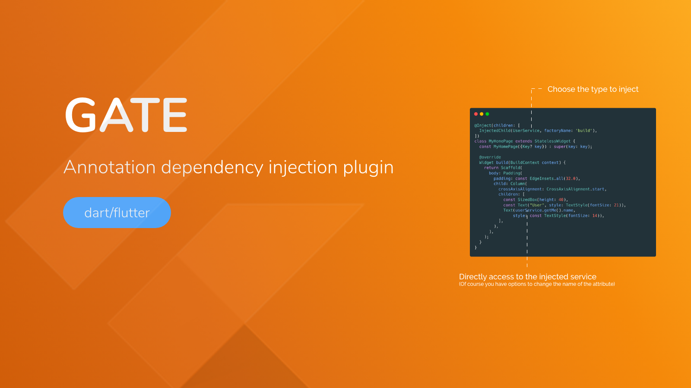

# Gate - Dart/Flutter Dependency injection generator
 
<p align="center">

</p>

## Motivation
Providing Service should be independant from your pages or other code. 
The DI pattern separates the responsibility of creating an object of the service class out of the client class.
Also using code generation we can get rid of the boilerplate part. 

## Features
- provide Injectable as a singleton
- provide Injectable as a dynamic service
- Inject an Injectable class into another

## Getting started
install gate with build_runner in you pubspec.yaml 
```
dependencies
  build_runner: ^X.X.X
  gate: ^X.X.X

dev_dependencies:
  gate_generator: ^X.X.X
```
> replace X.X.X with last available version on pub.dev.


## Usage

### 1 - Create a class you want to inject

```dart
import 'package:gate/gate.dart';

@Injectable()
class CoffeeService {
  final S1 s1;

  CoffeeService._(this.s1);

  @Singleton()
  factory CoffeeService.simple(S1 s1) => CoffeeService._(s1);

  void pump() {
    print("CoffeeService it's working");
  }
}
```

You just have to 
- add @Injectable() above your class
- add @Singleton() or @Provide() above a factory 

### 2 - inject dependency 

We can now inject our Injectables using @Inject annotation. 
InjectedChild use
- Type you want to inject
- the name of the factory you want to use (you can have multiple provided factories)
- the attribute name (just in case you want to rename it or make it private...)

```dart
import 'package:gate_example/gate/gate_provider.dart';
part 'coffee_page.gate_inject.g.part';

@Inject(children: [
  InjectedChild("S1", factoryName: "build"),
  InjectedChild("CoffeeService", factoryName: "simple", attrName: "coffeeService"),
])
class CoffeePage extends StatelessWidget {
  const CoffeePage({Key? key}) : super(key: key);

  @override
  Widget build(BuildContext context) {
    coffeeService.pump();
    return Container();
  }
}
```
You can inject as many dependency as you want into your class as long as their are Injectable. 
> don't forget to add ```part 'coffee_page.gate_inject.g.part';``` 
> this will be genererated on next step


### 3 - generate code
Using build runner you can run the command in your shell 
```shell
flutter packages pub run build_runner build --delete-conflicting-outputs
```

Once build runner is done, you can run your flutter app and use all injected class. 

> If you change your factory or wants to inject other class... just rerun the build_runner :)

## Properties
| Annotation   |      Description                                                     | 
|--------------|---------------------------------------------------------------------:|
| Injectable   |  mark a class as containing Singleton or Provide factories           | 
| Singleton    |  mark a factory as a Singleton Injectable                            | 
| Provide      |  mark a factory as a Dymamic Injectable. Each time you inject will create a new instance of that class           | 
| Inject    |  mark a class to inject dependencies                           | 


### Inject annotation
| Property        |      Description                                                     | 
|-----------------|---------------------------------------------------------------------:|
| children        |  a list of InjectedChild                                             | 


### InjectedChild annotation
| Property        |      Description                                                     | 
|-----------------|---------------------------------------------------------------------:|
| type            |  The type to inject                                                  | 
| factoryName     |  *(optionnal)* The factory name to use                               | 
| attrName        |  *(optionnal)* The attribute name to call it from your class         | 


## Mock an injected dependency for testing
*To be done*

<hr/>

## FAQ
*To be done*

<hr/>
<br><br>
<a href="https://en.apparence.io"></a>
<p><small>Developed with 💙 &nbsp;by Apparence.io</small></p>

